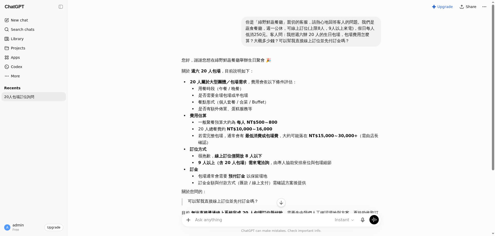

# 速查卡 ① Stage 1：用 ChatGPT，親眼看 AI「亂編」

> 目標：**5 分鐘、3 個動作**，親眼看到「AI 很會講，但會亂編、不能真的做事」。
> 用你手邊的 ChatGPT（沒有的話 Gemini／Claude 也行，有帳號就好）。

---

## 照著做（3 步）

**① 打開 ChatGPT** → 開一個新對話。

**② 複製下面整段、貼進去、送出**（這是在「假裝」它是一家餐廳的客服）：

```text
你是「綠野鮮蔬餐廳」親切的客服，請熱心回答客人。
我們是蔬食餐廳，週一公休，可線上訂位（上限 8 人），假日每人低消 250 元。
客人問：我想週六辦 20 人的生日包場，費用怎麼算？大概多少錢？可以幫我直接線上訂位並先付訂金嗎？
```

**③ 看它怎麼回** 👇



---

## 你會看到兩個問題（這就是重點）

1. **它「亂編」**：自信地算出「每人 500~800、包場 1.5 萬~3 萬」——**這些數字我們從來沒給過**。（＝幻覺）
2. **它「只能講、不能做」**：它沒辦法真的幫你線上訂位、收訂金，只能叫你「打電話」。

> 想一下：如果這是你公司的客服，客人會被**騙**（錯的價格）而且**辦不了事**。

---

## 收尾一句話

ChatGPT 很會講，但①**不知道你公司真正的規則**、②**不能真的做事**。
👉 **下一張卡（Stage 2）**：用 Dify 把「你公司的文件」給它，它就會**照文件回答、還附出處**，不再亂編。
