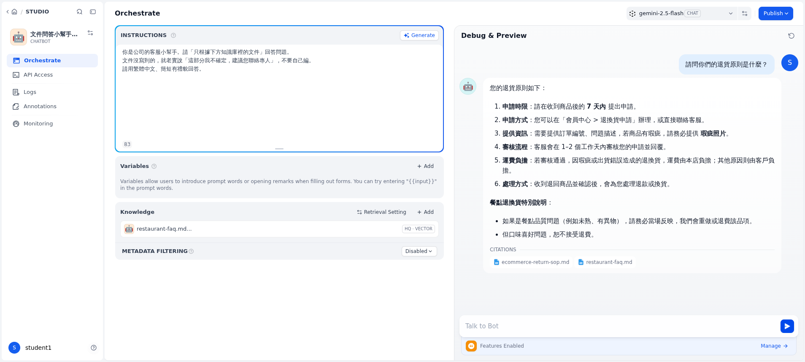

# 速查卡 ② Stage 2：用 Dify，給它公司文件就不亂編

> 目標：把「公司文件」餵給機器人，讓它**照文件回答、還附出處**。
> 全程**點選 + 貼上**，不用打任何指令。看到畫面跟圖一樣就對了。

---

## Part A：先做一個「文件櫃」（知識庫）

**A1** 用講師給的網址＋帳密登入 Dify → 上方點 **Knowledge（知識）**。
**A2** 右上 **Create** →「**Create a ready-to-use knowledge base**」→ 把講師給的 2 份文件拖進去（或 Browse 選檔）→ **Next**。


**A3** 這頁**什麼都不用改**，直接看到 **High Quality** 有選、下方模型有帶到 → 右下 **Save & Process**。


**A4** 等兩份文件都變 **Available（可用）** ＝ 文件櫃做好了。


---

## Part B：做一個「照文件回答」的機器人（Chatbot）

**B1** 上方 **Studio** → 右上 **Create** →「**Create from Blank**」→「**More basic app types**」→ 選 **Chatbot**（⚠️ 選這個最單純，**不要選 Agent**）→ 取個名字 → **Create**。

**B2** 在 **Instructions（指令）** 貼這句：
```text
你是公司的客服小幫手。請只根據下方知識庫裡的文件回答；
文件沒寫到的就說「這部分我不確定，建議您聯絡專人」，不要自己編。用繁體中文、簡短有禮。
```

**B3** 找到 **Knowledge（知識）** 區 → 按 **Add** → 勾剛剛做好的文件櫃 → **Add**。

**B4** 右邊 **Talk to Bot** 打一句：**「請問你們的退貨原則是什麼？」** → 送出。



---

## 你會看到（跟 Stage 1 對比）

- ✅ **照文件回答**（7 天、瑕疵照片、運費負擔…都是文件裡的真規則）
- ✅ **附出處**（下方 CITATIONS 列出是哪份文件）→ 不再亂編
- 多問幾題：「運費怎麼算？」「可以刷卡嗎？」都會照文件答。

## 收尾

同一個問題，Stage 1 亂編、Stage 2 照文件答還給出處。**差別就在有沒有給它「公司文件」當開書考。**
👉 讓它更進一步（**會查訂單、接 LINE、處理複雜關係**）＝看老師示範，回公司再交給工程師。
