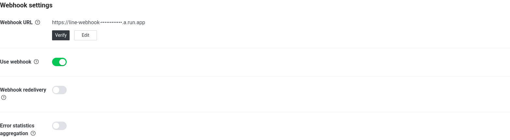

# 把 Dify 客服接到 LINE（進階／選讀）

> 這是整個課程**最容易卡、最抽象**的一段。先看懂「為什麼要這樣」，再照步驟做就不慌。
> LINE 不是今天必做；想接的人（或現場助教/內部同仁）照這份走。

---

## 先破除抽象感：一張圖看懂

```
你的手機 LINE
   │ 傳訊息
   ▼
LINE 平台 ──(webhook, 必須 HTTPS)──►  GCP Cloud Function（雲端小程式）
                                          │  ① 驗證訊息真的來自 LINE（簽章）
                                          │  ② 把文字丟給 Dify、拿答案
                                          ▼
                                   你的 Dify 客服 app（/v1/chat-messages）
                                          │  回答案
                                          ▼
LINE 平台 ◄──(用 LINE 回覆 API)── Cloud Function ── 答案
   │
   ▼
你的手機收到回覆
```

**最重要的觀念（很多人卡在這）：**
- **Dify 本身不直接連 LINE**。你在 Dify 介面裡**找不到「LINE」設定**——因為「接 LINE」的邏輯不在 Dify，而在中間那個 **Cloud Function**。
- **Cloud Function 是什麼**：一段放在 GCP 上、有公開 HTTPS 網址的小程式。LINE 規定 webhook 一定要 HTTPS，而且要「驗簽章 → 呼叫 Dify → 再用 LINE API 回覆」這串動作，Dify 不做，所以用這個小程式當**橋樑**。程式我們已經寫好（`functions/line-webhook/`），你只要**帶入你的值去部署**即可。

---

## 你需要備齊三樣東西

| # | 東西 | 哪裡拿 |
|---|------|--------|
| 1 | Dify app **已發布** + 一把 **API 金鑰**（`app-...`） | Dify → 你的 app → 右上 Publish；再到 **API Access → API Key → Create new secret key** |
| 2 | LINE **Messaging API channel** 的 **Channel secret** + **Channel access token** | LINE Developers Console → 你的 channel |
| 3 | 一個 **Cloud Function**（程式現成，帶值部署） | 見下方步驟 B |

---

## 步驟（每步都先驗證再往下）

### A. Dify 端：拿 app 金鑰
1. 你的 app 右上 **Publish → Publish Update**（沒發布，API 叫不動）。
2. 左側 **API Access** → 右上 **API Key** → **Create new secret key** → 複製 `app-...`。
3. 記下你的 Dify 服務網址：`http://<你的Dify-IP>/v1`。

### B. 部署 Cloud Function（把 LINE 與 Dify 的值帶進去）
準備一個 `env.yaml`（**不要 commit，含密鑰**）：
```yaml
LINE_CHANNEL_SECRET: "你的 channel secret"
LINE_CHANNEL_ACCESS_TOKEN: "你的 channel access token"
DIFY_API_BASE: "http://<你的Dify-IP>/v1"
DIFY_APP_KEY: "app-..."
```
部署（名字每人不同，例如 `line-webhook-student3`）：
```bash
gcloud functions deploy line-webhook-<你> --gen2 --runtime=python311 --region=asia-east1 \
  --source=functions/line-webhook --entry-point=line_webhook \
  --trigger-http --allow-unauthenticated \
  --env-vars-file env.yaml --project <你的GCP專案>
```
部署完會印出一個網址：`https://line-webhook-<你>-xxxx.a.run.app` ← **記下來，下一步要貼**。

> ★ 眉角：Dify app 若是 **Agent** 類型，橋接程式呼叫 Dify 必須用 **streaming** 模式（blocking 會被 Dify 拒：`Agent Chat App does not support blocking mode`）。本 repo 的 `main.py` 已用 streaming，不用改。

### C. LINE Console：把網址設成 webhook
1. <https://developers.line.biz/console/> 登入（沒帳號可用手機 LINE 掃 QR 登入）→ 你的 channel → **Messaging API** 分頁。
2. 找到 **Webhook settings** → **Webhook URL** 按 **Edit** → 貼上 B 的網址 → **Update**。
3. 按 **Verify** → 應跳 **Success**（代表 LINE 連得到你的 Cloud Function）。
4. **Use webhook** 切到 **ON**（綠色）。**沒開，訊息根本不會送到你的函式** ← 最常漏這個。
5. 到 **LINE Official Account Manager** 把「**自動回應訊息 / 加好友歡迎訊息**」**關掉**，否則官方罐頭訊息會蓋掉你的 bot。

設定完成長這樣（Webhook URL 已填、有 Verify 鈕、Use webhook 綠色開啟）：



### D. 不用手機也能先驗證（建議先做）
- 直接打 Dify app API，確認 app 會回答：
  ```bash
  curl -N -X POST "http://<你的Dify-IP>/v1/chat-messages" \
    -H "Authorization: Bearer app-..." -H "Content-Type: application/json" \
    -d '{"inputs":{},"query":"訂單 A1001 狀況","response_mode":"streaming","user":"test"}'
  ```
  → 應看到「已出貨…」串流回來。
- LINE Console 的 **Verify** 按鈕（送空訊息）→ Success 代表 webhook 通了。

### E. 手機實測
手機加你的 LINE OA 好友 → 傳「**訂單 A1001 狀況**」→ 應收到 bot 回覆。

---

## 常見卡點（對照排查）

| 症狀 | 原因 / 解法 |
|------|------|
| Webhook **Verify 失敗** | URL 沒貼對、**Use webhook 沒開**、或 Cloud Function 還在部署中（等 1 分鐘） |
| LINE 一直回**罐頭訊息**、不回 bot | 沒關「自動回應訊息」（在 LINE Official Account Manager） |
| bot 都回「**幫您轉接專人**」 | Agent 這題沒去查知識庫 → demo 用穩定命中的題（**訂單 A1001**、**退貨原則**） |
| 函式報 `Agent ... does not support blocking mode` | 橋接要用 **streaming**（本 repo 已修） |
| 查訂單/知識**回錯誤** | Dify 的 **SSRF proxy 擋內網**；見講師 checklist B3③（放行 `10.20.0.0/16`） |
| 完全沒反應 | 對 webhook 送「正確簽章」測試 POST 應回 200、亂簽回 403；都不對 → 檢查 CF 環境變數 |

> 一句話總結：**Dify 負責「會回答」，Cloud Function 負責「把 LINE 和 Dify 接起來」。** 兩邊各自顧好，中間用那個網址串上。
